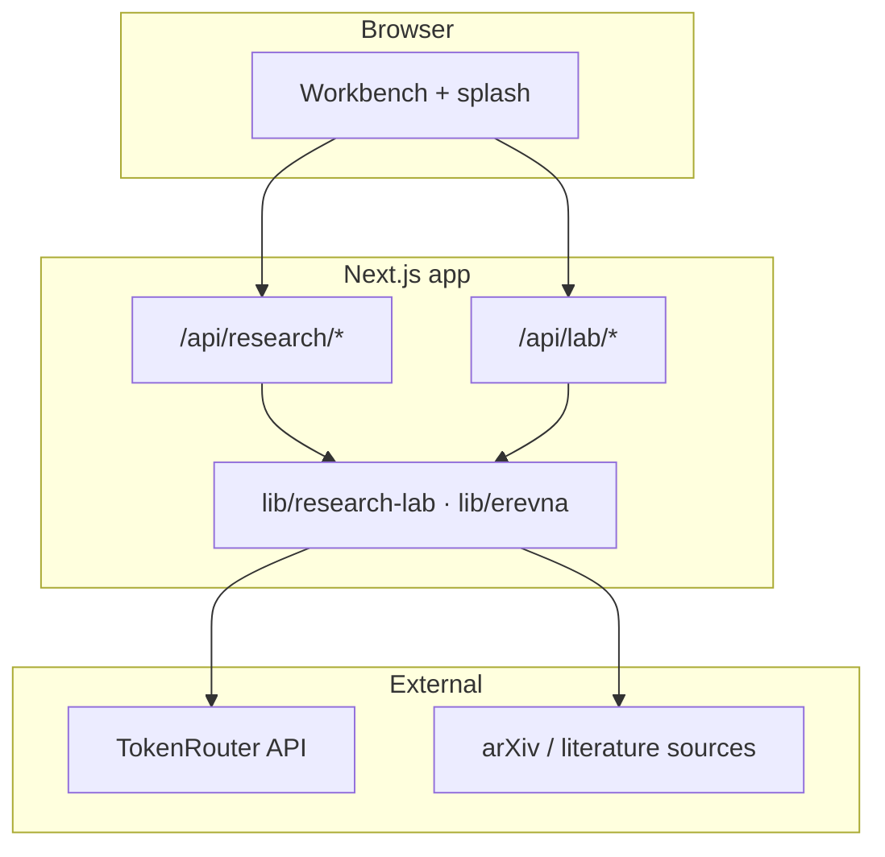
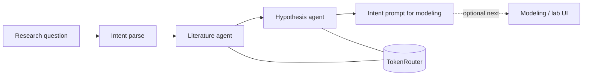

# Erevna

Autonomous research pipeline foundation for the hackathon build: a **Next.js** app where you ask a research question, run **literature + hypothesis** agents through **TokenRouter**, then attach a **CSV** and run the **ML lab** (train, evaluate, predict, export).

---

## Contents

- [Stack](#stack)
- [Repository layout](#repository-layout)
- [Architecture (high level)](#architecture-high-level)
- [Research pipeline (graph)](#research-pipeline-graph)
- [What is implemented](#what-is-implemented)
- [Home page UX](#home-page-ux)
- [Local setup](#local-setup)
- [TokenRouter setup](#tokenrouter-setup)
- [Agent LLM calls](#agent-llm-calls)
- [MCP (Reboot)](#mcp-reboot)

---

## Stack

| Layer | Choice |
|--------|--------|
| App | Next.js (App Router), React, TypeScript |
| UI | `app/globals.css` + `frontend/erevna/*` workbench |
| Research LLM | TokenRouter via `lib/research-lab/agent-llm.ts` |
| Optional tools | Reboot `durable-mcp` in `reboot_mcp/` |

---

## Repository layout

```text
app/                    # Next.js routes, pages, global CSS
  api/                  # HTTP handlers (research + lab)
  home-with-loader.tsx  # Client shell: splash → workbench
  page.tsx              # Home entry
frontend/erevna/        # Workbench UI (intake, trace, topology, evidence)
lib/
  research-lab/         # Pipeline, agents, TokenRouter client
  erevna/               # Lab runner, types, reports
reboot_mcp/             # Optional MCP server (see reboot_mcp/README.txt)
public/data/            # Demo CSV for local try-outs
```

---

## Architecture (high level)



---

## Research pipeline (graph)

Server-side research flow (simplified from `lib/research-lab/research-pipeline.ts` and agents):



Events emitted along the way use `ResearchPipelineEvent` (`agent`, `stageId`, `status`, `message`). The `/api/research/run` route can stream those over SSE when `stream: true`.

---

## What is implemented

- A single **server-only** LLM entrypoint for research agents, backed by **TokenRouter**
- A **Literature Agent** that retrieves arXiv papers and summarizes them through TokenRouter
- A **Hypothesis Agent** that proposes a testable hypothesis and target column hints
- **`runResearchPipeline`** in `lib/research-lab/research-pipeline.ts` orchestrating stages and events
- **Lab** routes: resolve CSV → run training pipeline → predict → artifacts (see `app/api/lab/*`)
- A **development smoke** route for TokenRouter credentials (`/api/tokenrouter-smoke`)
- **Home**: brief full-viewport splash (`HomeWithLoader`) then the existing **Erevna workbench** below (scroll to use the lab)

---

## Home page UX

1. Open `/` — you see a **full-height splash** (title + short loading state + subtle background glow).
2. After ~1.1s the copy invites you to **scroll** into the workbench; anchor `#erevna-workbench` jumps to the main UI.

Implementation: `app/home-with-loader.tsx` + `.erevna-splash*` rules in `app/globals.css`.

---

## Local setup

```bash
npm install
npm run dev
```

Open [http://localhost:3000](http://localhost:3000).

---

## TokenRouter setup

Create a TokenRouter API key and add it to `.env.local`:

```bash
TOKENROUTER_API_KEY=tr_your_api_key_here
TOKENROUTER_BASE_URL=https://api.tokenrouter.com/v1
TOKENROUTER_MODEL=openai/gpt-4o-mini
```

Restart `npm run dev`, then verify the server-side TokenRouter connection:

```bash
curl "http://localhost:3000/api/tokenrouter-smoke"
```

The smoke route is available only in development. A successful response returns `ok: true` plus model, provider, and usage metadata when TokenRouter includes it. After the request, check the TokenRouter dashboard for the `SmokeTest` agent call.

---

## Agent LLM calls

All research agents should call `generateResearchAgentText()` or `generateResearchAgentJson()` from `lib/research-lab/agent-llm.ts`. That wrapper routes through TokenRouter using `TOKENROUTER_API_KEY`, `TOKENROUTER_BASE_URL`, and `TOKENROUTER_MODEL`.

Run the Literature Agent:

```bash
curl -X POST "http://localhost:3000/api/research/literature" \
  -H "Content-Type: application/json" \
  -d '{"researchQuestion":"Does sleep quality affect student academic performance?"}'
```

Run the Hypothesis Agent:

```bash
curl -X POST "http://localhost:3000/api/research/hypothesis" \
  -H "Content-Type: application/json" \
  -d '{
    "researchQuestion":"Does sleep quality affect student academic performance?",
    "literatureSummary":"Sleep patterns correlate with academic outcomes in student behavior studies.",
    "keyFindings":[
      "Sleep patterns are strongly correlated with academic performance."
    ]
  }'
```

Run the first pipeline stages together:

```bash
curl -X POST "http://localhost:3000/api/research/run" \
  -H "Content-Type: application/json" \
  -d '{"researchQuestion":"Does sleep quality affect student academic performance?","maxResults":2}'
```

Stream status events for the run:

```bash
curl -N -X POST "http://localhost:3000/api/research/run" \
  -H "Content-Type: application/json" \
  -d '{"researchQuestion":"Does sleep quality affect student academic performance?","maxResults":2,"stream":true}'
```

---

## MCP (Reboot)

Optional **Reboot `durable-mcp`** server in `reboot_mcp/` exposes **`http://127.0.0.1:9991/mcp`** for agent tool calls (see `reboot_mcp/README.txt`). Run **`npm run dev`** for the Next app and **`uv run rbt dev run`** in `reboot_mcp` with Docker running.
